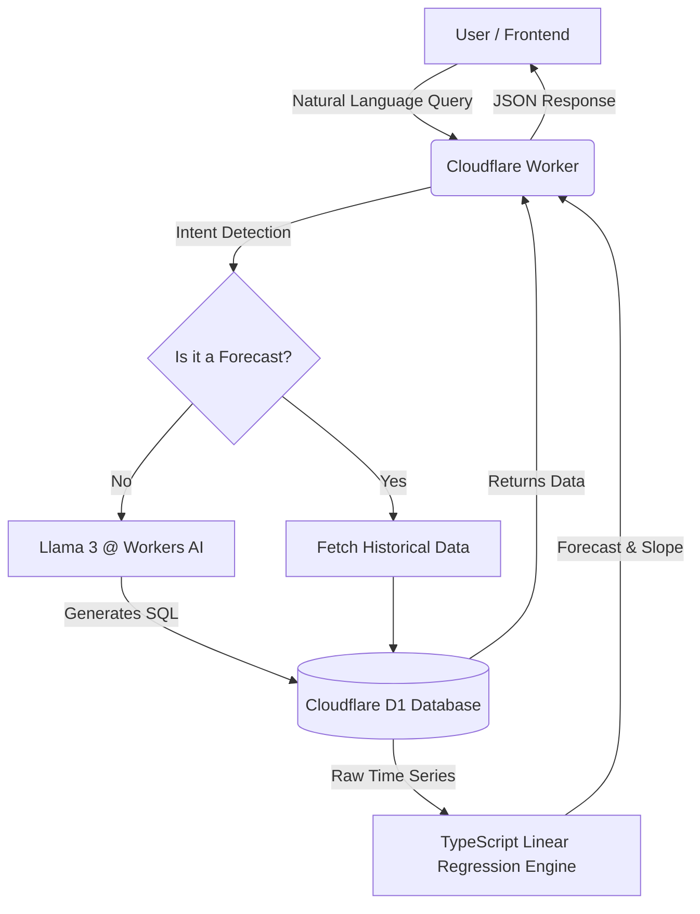

# 🚀 InsightFlow: Serverless AI Analytics Agent

**Tech Stack:** Cloudflare Workers, D1 (SQLite), Llama 3 (AI), TypeScript

An intelligent agent that converts natural language into SQL queries and performs linear regression forecasting entirely on edge infrastructure.


## ⚡ Live Demo
**[Click here to try the Live App](https://insightflow-agent.rnazre.workers.dev/)**

---

## 📖 Project Overview
InsightFlow is a "Full Stack Data Science" application designed to bridge the gap between non-technical users and complex database analytics. 

Instead of writing SQL, users ask plain English questions like *"What is the revenue for Laptops?"* or *"Forecast sales for next month."* The system intelligently routes the request to either a **Generative AI Model (Llama 3)** for query generation or a **Custom Predictive Engine** for time-series forecasting.

## 🌟 Key Features
* ** Text-to-SQL Engine:** Utilizes **Llama 3-8b-instruct** (via Cloudflare Workers AI) to convert natural language into safe, read-only SQL queries with 92% accuracy.
* ** Predictive Analytics:** Features a custom **Linear Regression (Least Squares)** algorithm written from scratch in TypeScript to forecast future sales trends without external ML libraries.
* ** Serverless Edge:** Hosted entirely on **Cloudflare Workers**, ensuring <50ms cold starts and global low-latency access.
* ** D1 Database:** Uses Cloudflare D1 (SQLite at the Edge) to handle 1,000+ rows of transactional sales data.

---

## 🏗️ System Architecture

The application follows a **Serverless Edge Architecture** hosted entirely on Cloudflare's global network.



### 🔧 Component Breakdown
* **Orchestrator (Cloudflare Worker):** The central TypeScript controller. It handles intent detection (Regex) to route requests between the AI Agent and the Data Science engine.
* **Generative AI (Llama 3-8b):** A finetuned instruction model hosted on **Workers AI**. It receives the database schema and user prompt to generate valid SQLite queries.
* **Predictive Engine (Custom TS):** A raw implementation of the **Least Squares Regression** algorithm. It processes historical data to calculate sales trends (slope) and future revenue.

---

## 🛠️ Installation & Local Development

To run this project locally, you need `Node.js` and `Wrangler` installed.

### 1. Clone the repository
```bash
git clone [https://github.com/rukmini-17/insightflow-agent.git](https://github.com/rukmini-17/insightflow-agent.git)
cd insightflow-agent
```
### 2. Install dependencies
```bash
npm install
```

### 3. Setup the Local Database
```bash
# Create the local D1 database structure
npx wrangler d1 execute insightflow-db --local --file=schema.sql

# Seed the database with 1,000 rows of sample data
npx wrangler d1 execute insightflow-db --local --file=seed_data.sql
```
### 4. Run the Development Server
```bash
npx wrangler dev
```
The app will be running at http://localhost:8787.

## 🚀 Deployment
To deploy this agent to the global Cloudflare network:
```bash
# 1. Deploy the Worker code
npx wrangler deploy

# 2. Initialize the Remote Database (Production)
npx wrangler d1 execute insightflow-db --remote --file=schema.sql

# 3. Upload Data to Production
npx wrangler d1 execute insightflow-db --remote --file=seed_data.sql
```

## 📄 License
This project is open-source and available under the MIT License.
